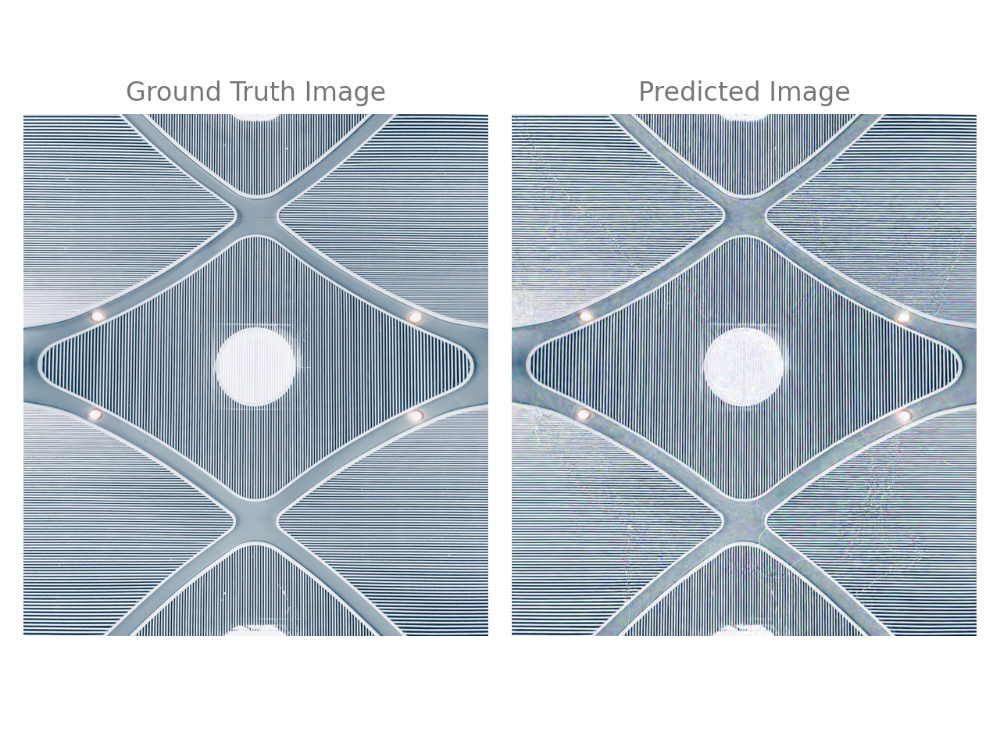
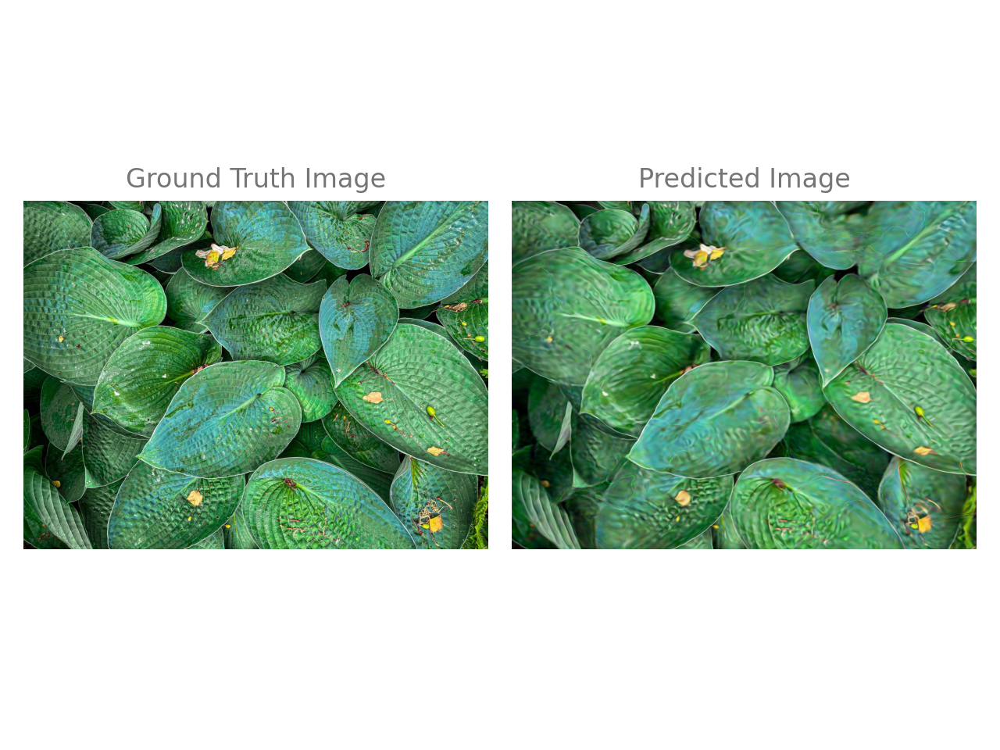
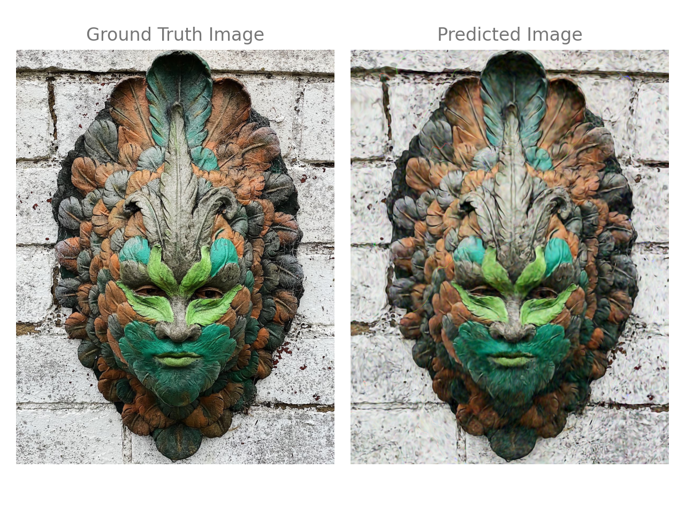
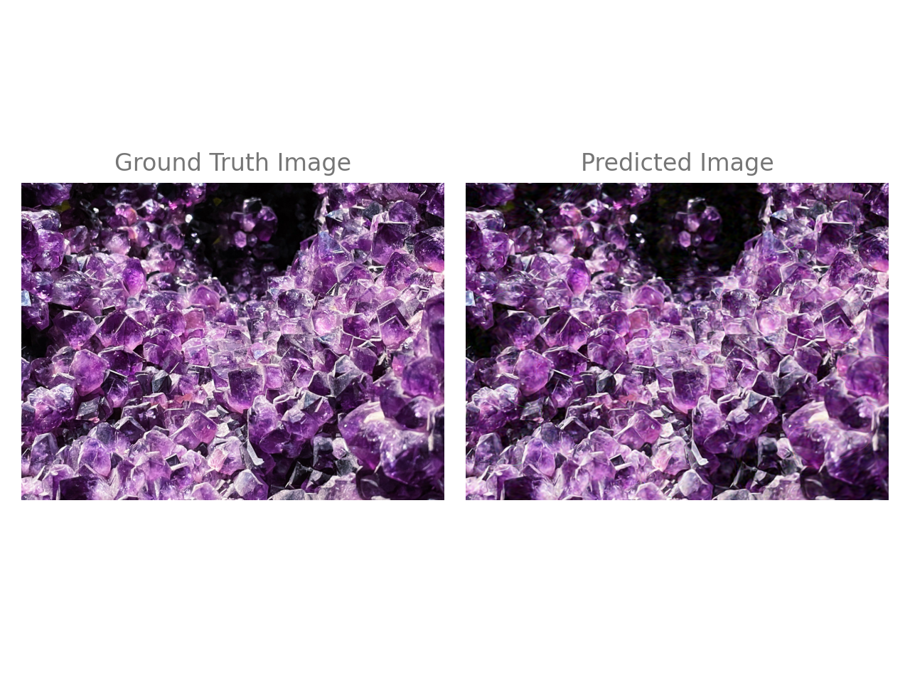

# Siren and FilmSiren TF 2 : Implicit Neural Representations with Periodic Activation Functions

The unofficial Tensorflow 2 implementation of the paper Implicit Neural Representations with Periodic Activation Functions. Please note that, this repo tested with image fitting experiments.

### [Paper](https://arxiv.org/abs/2006.09661) | [Official PyTorch Implementation](https://github.com/vsitzmann/siren)


## Get Started
To start working with this repository please install Python packages using:

```sh
conda env create --file setup/environment.yaml
```

## Training
```sh
python main.py --train --input_image samples/leaves.jpg  --output_dir results/leaves --n_epochs 1000
```

## Testing

```sh
python main.py --input_image samples/leaves.jpg  --output_dir results/leaves/
```

## Results


|   |   |
|---|---|
|  |     |
|    |   |


### 3 layers,  256x256 image size training 1000 epoch mean square errors.
| Image_file  | Baseline  |  TF  |   
| :---        |    :----:   |   :----:  |
| istanbul_airport.jpg  | 0.0020  | 0.0056  |
| face.jpg  | 0.0021  | 0.0061  |   
| stone_nsm.jpg  | 0.0011  | 0.0016  |   
| leaves.jpg  | 0.0014  |  0.0037 |  


## References

- [Siren Pytorch Official Repository](https://github.com/vsitzmann/siren/)
- [Siren Tensorflow Repository](https://github.com/titu1994/tf_SIREN)


